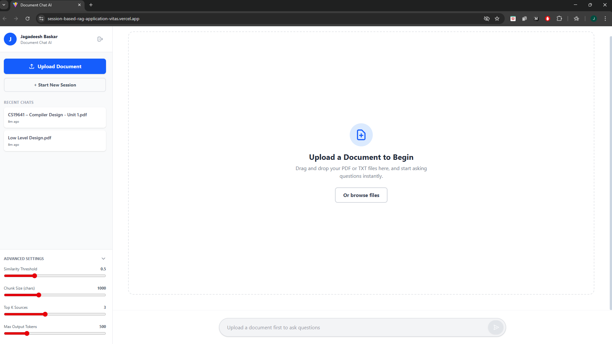

# Document Chat AI — Session-Based RAG Application




Document Chat AI is a full-stack application that lets you upload any PDF or TXT file and have a real conversation with it. Ask questions, get summaries — all powered by Google Gemini and a custom-built vector retrieval engine running entirely in memory. It contains No Database and does not store on disk.

---

## Features

- Upload PDF or TXT documents and start asking questions
- Finds the most relevant parts of your document using vector similarity search
- Generates accurate, context answers by using Google Gemini API
- Refuses to answer questions outside your document's content.
- Google OAuth login — no passwords to manage.
- Advanced controls to tune retrieval behaviour to your content retrievel
- Session-based chat history saved in your browser

---

## Getting Started

### Prerequisites
- Node.js
- Git
- A Google Gemini API key
- A Google OAuth Client ID

### 1. Clone the repo

```bash
git clone <your-repo-url>
cd <your-repo-name>
```

### 2. Set up the Backend

```bash
cd backend
npm install
```

Create a `.env` file inside the `backend` folder:

```
PORT=3000
GEMINI_API_KEY=your_google_gemini_api_key
```

Start the backend server:

```bash
npm run dev
```

### 3. Set up the Frontend

Open a new terminal tab:

```bash
cd frontend
npm install
```

Create a `.env` file inside the `frontend` folder:

```
VITE_API_URL=http://localhost:3000
VITE_GOOGLE_CLIENT_ID=your_google_oauth_client_id
```

Start the frontend:

```bash
npm run dev
```

Then open `http://localhost:5173` in your browser — you're good to go.

---


The app is split into two independent pieces:

**Frontend** (React + Vite) handles Google OAuth login, renders the chat UI, saves session history in LocalStorage, and lets you change retrieval settings during the chat.

**Backend** (Node.js + Express) handles file uploads in memory (never touches disk), parses document text, generates vector embeddings via Gemini, and runs the similarity search to find the right context before answering.

There's no external database — all vector embeddings live in a Node.js `Map()`, scoped strictly to each user's session ID.

---


### How retrieval actually works

When you upload a document, the backend breaks it into overlapping chunks (default: 1000 characters with a 200-character overlap). Each chunk gets converted into a vector — a large array of numbers that captures its semantic meaning — using Gemini's `gemini-embedding-001` model.

When you ask a question, the same model converts your question into a vector. The backend then compares your question's vector against every chunk's vector using **cosine similarity** to find the most relevant passages.

To make this fast, all vectors are pre-normalised during upload. This reduces the similarity calculation to a simple dot product — no square roots, no heavy math at query time:

```typescript
let dotProduct = 0;
for (let i = 0; i < vecA.length; i++) 
dotProduct += vecA[i] * vecB[i];
return dotProduct;
```

The top matching chunks get passed to Gemini as context, and you get your answer.

Two guardrails prevent the model from making things up:

1. **Similarity threshold** — if no chunk scores above your defined threshold, the backend never even calls the LLM. It returns a rejection message immediately.
2. **Strict prompt injection** — the system prompt explicitly tells the model to answer *only* from the provided context. If the answer isn't there, it says so.


## Advanced Settings

You can tune these directly in the UI:

 **Similarity Threshold** : Higher the threshold,higher will be the context accuracy. 
 **Top K Sources** : How many chunks get fed to the LLM as context. 
 **Chunk Size** : Larger chunks = broader context. Smaller = more precise. 
 **Max Output Tokens** : Caps how long the AI's response can be. 

---

## Key Dependencies

Package Used : 
1. `@react-oauth/google` -> Google OAuth login without building custom auth from scratch 
2. `@google/generative-ai` -> Powers both the embedding generation and answer generation 
3. `multer` -> Intercepts file uploads and holds them in RAM — never written to disk 
4. `pdf-parse` -> Fast, server-side PDF text extraction — no browser libraries needed 
5. `react-markdown` -> Renders the AI's markdown-formatted responses properly in the UI 

---

## Issues I faced during developing : 

**Chat not auto-scrolling** — Long responses meant users had to scroll manually. Fixed with a `useRef` at the bottom of the message list and a `useEffect` that calls `.scrollIntoView()` whenever messages update.

**Timestamps updating on every click** — The "Recent Chats" list was refreshing its timestamp whenever I clicked a session, not just when new messages arrived. Fixed with a `contentChanged` flag that only updates the timestamp when the message count actually changes.

**Markdown rendering as raw text** — Gemini returns `**bold**` syntax which React renders literally. Fixed by integrating `react-markdown` to properly parse and render all markdown formatting.

**LLM cutting off mid-sentence** — Overly strict prompts were causing the model to stop early. Fixed by upgrading to `gemini-1.5-flash` and rewriting the prompt to instruct the model to always complete its response fully.

**CORS blocking on production** — Vercel frontend requests were being blocked by the Render backend after deployment. Fixed by explicitly allowing `origin: '*'` and the custom `x-session-id` header in the Express CORS config.

**Memory leaks from deleted sessions** — Deleting a chat from the UI only removed it visually — the vectors stayed in RAM. Fixed with a `DELETE /api/session` endpoint that flushes the server memory for that session entirely.

**Duplicate files in the UI** — Re-uploading the same file caused it to appear twice in the active files list. Fixed with a state filter in `App.tsx` that removes the old entry before adding the new one.

---

## Known Limitations

1. Volatile In-Memory Storage

**The Limitation**: All vector embeddings and session data are stored directly inside the Node.js RAM (using a JavaScript Map) rather than a hard drive.
**The Impact**: Because the storage is volatile, if the Render server goes to sleep, restarts, or scales horizontally to multiple instances, all user session data and uploaded document vectors are instantly and permanently erased.
**The Fix**: Migrate the vector storage layer to a persistent, disk-backed vector database like Pinecone, ChromaDB, or pgvector.

2. Single-Thread Event Loop Blocking

**The Limitation**: PDF text extraction and chunk embedding are executed synchronously on the main Node.js thread.
**The Impact**: Node.js operates on a single thread. If a user uploads a massive 500-page PDF, the CPU will be monopolized during the parsing and embedding loop. During this time, the event loop is "blocked," meaning if another user tries to send a simple chat message, their request will hang and wait until the massive PDF is finished processing.
**The Fix**: Decouple the architecture by introducing a background job queue (e.g., Redis + BullMQ) to handle document processing asynchronously on separate worker threads.

3. Lack of Spatial / Visual Citations

**The Limitation**: The application's pdf-parse library extracts pure raw text, stripping away all formatting and spatial metadata (X/Y coordinates on the page).
**The Impact**: When the AI provides a citation, the frontend can only display the raw text snippet in the "Retrieved Sources" dropdown. The user still has to manually Ctrl+F through their actual PDF to figure out exactly which page and paragraph the text came from.
**The Fix**: Upgrade to a layout-aware PDF parser (like PyMuPDF) that maps text to page coordinates, allowing the frontend to overlay a visual yellow highlighter box directly onto the original PDF document.

## Future Improvements

1. Persistent Vector Storage

**What to add**: A dedicated vector database like ChromaDB, Pinecone, or pgvector.
**Uses**: Replaces the temporary, RAM-based Map() store with a permanent database engine.
**Why****: Currently, all document embeddings exist purely in the server's RAM. If the Node.js server goes to sleep or restarts, all session data is wiped. Integrating persistent storage ensures user sessions and processed documents survive server reboots, allowing users to return days later without re-uploading their files.

2. Background Task Queue (Asynchronous Processing)

**What to add**: A message broker and job queue system, such as Redis combined with BullMQ.
**Uses**: Offloads the heavy CPU work of PDF parsing and API embedding generation to a separate background worker process.
**Why**: Node.js operates on a single thread. If a user uploads a massive 500-page PDF, processing chunks sequentially blocks the main event loop. This prevents other users from sending messages while the PDF is processing. A background queue ensures the main chat interface remains lightning-fast for everyone, while heavy processing happens safely in the background.

3. Multi-Turn Conversation Memory

**What to add**: An array state payload that passes the last 4-5 chat messages along with the new user query to the Gemini API.
**Uses**: Provides the LLM with the context of the ongoing conversation, not just the isolated document chunks.
**Why**: Currently, the app functions as a "Single-Turn QA" tool. If the AI lists three methods and the user replies, "Can you explain the second one in more detail?", the AI lacks the memory to know what "the second one" refers to. Injecting chat history transforms the app into a true, context-aware conversational assistant.

4. PDF Spatial Highlighting

**What to add**: A layout-aware PDF parsing library (like PyMuPDF) combined with a frontend PDF viewer (like react-pdf).
**Uses**: Extracts not just the text, but the exact X/Y coordinate bounding boxes for every word on the original PDF page.
**Why**: Instead of just showing raw text snippets in the "Retrieved Sources" dropdown, the app could display the actual visual PDF side-by-side with the chat. When the AI answers, it could draw a yellow highlight box over the exact paragraph it used to generate the answer, drastically improving user trust and verifiability.